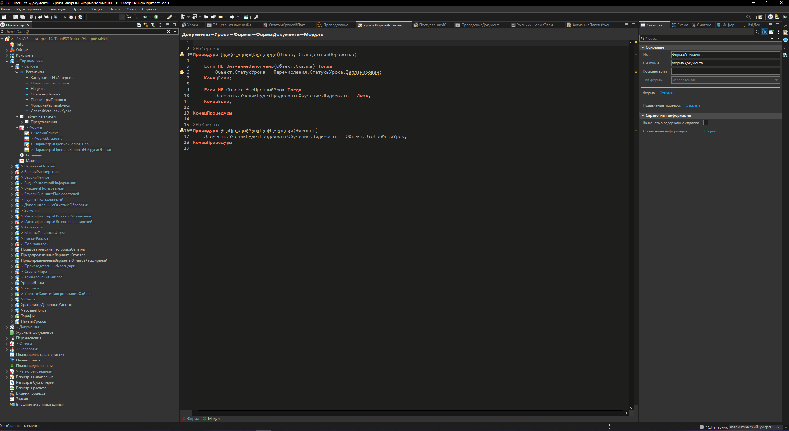
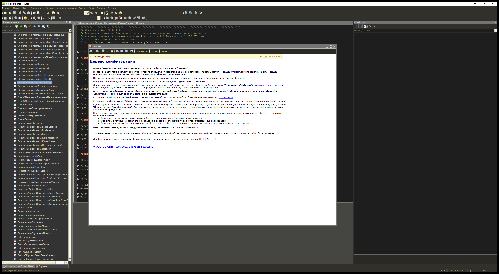

# 1C Configurator Theme Engine

Тёмная тема (EDT Dark) для конфигуратора 1С — **без модификации файлов платформы**. DLL внедряется в процесс 1cv8.exe и перекрашивает интерфейс на лету; выгрузка возвращает светлую тему без перезапуска.

**Версия: v5.4** · 1cv8.exe x86 · MSVC 2022 · Python-инжектор

| Референс (1C:EDT) | Результат (v5.4) |
|---|---|
|  |  |

## Принцип работы

1С рисует весь UI сама (owner-draw) через **Cairo** (`grphcs.dll` → `cairo.dll`), справка — через WebKit. Поэтому тема перехватывает вызовы рендера и подменяет цвета до отрисовки:

- **EAT-патч** таблиц экспорта `cairo.dll` / `gdi32.dll` / `user32.dll` — хуки получают все модули, включая загруженные после инжекции (F1-справка, диалоги); IAT-патч и фоновый re-scan — страховка.
- **Хуки Cairo:** `cairo_set_source_rgb/rgba` (маппинг фонов; clip-контекст отличает дерево `#333333` от редактора `#1E1E1E`), `cairo_show_glyphs/show_text` (цвет текста + пропуск дублей emboss/bold через ring history).
- **Хуки GDI/USER:** `SetTextColor`, `ExtTextOutW`, `DrawTextW`, `CreateSolidBrush`, `FillRect`, `GetSysColor(Brush)` — ролевой маппинг (выделение и т.п.).
- **Карта цветов:** 24+ явных записей (near-match ±6) + HSL-fallback (инверсия lightness) + pale-tint правило.
- **Безопасная выгрузка:** все патчи журналируются и откатываются при `FreeLibrary` — процесс 1С не падает.

Инвариант **SKIP-ONLY**: дорисовывать в cairo-контексты и править пиксели кэшированных surface нельзя — изменения запекаются в кэш 1С/WebKit и переживают выгрузку DLL. Только пропуск дублей или перекраска до отрисовки.

Подробная документация — в [PROJECT_DOCS.md](docs/PROJECT_DOCS.md).

## Что сделано (история версий)

| Версия | Суть | Итог |
|--------|------|------|
| v1 | Хуки FillRect/SetBkColor | Нулевой эффект — 1С не рисует UI классическим GDI |
| v2 | + `cairo_set_source_rgb/rgba` | **Прорыв:** весь UI потемнел |
| v3 | Точная палитра + HSL-fallback + IAT-restore | FreeLibrary без отката IAT = краш; откат обязателен |
| v4.x | Clip-контекст, палитра EDT, ghost-fix emboss, карта лексем | Текст и код читаемы |
| v4.8 | Проверка гипотезы кэш-паттернов | Опровергнута; размытие заголовков — врождённый bold WebKit |
| v4.9 | RescanThread (F1), GDI ghost-fix (меню), COLOR_HIGHLIGHT | Поздние DLL требуют пере-патчинга |
| **v5.0** | **EAT-патч** cairo/gdi32/user32 | Поздние модули хукаются мгновенно; F1 тёмный сразу |
| **v5.1** | Pale-tint классификация | Жёлтая шапка F1 исправлена |
| **v5.2–5.3** | Ring-history suppression дублей (cairo + GDI) | Emboss и синтетический bold пропускаются |
| **v5.4** | Режим SKIP-ONLY, удалены redraw/surf-remap | Устранено отравление кэш-поверхностей |

## Дорожная карта

1. **IFEO-автозагрузка** — Windows сама загружает DLL при старте 1cv8.exe (без ручной инжекции и антивирусного риска).
2. Перерисовка без ресайза окна (InvalidateRect / WM_SETTINGCHANGE).
3. Проверка диалогов и форм объектов, дополнение карты цветов.
4. JSON-профили тем (Dracula / One Dark / Monokai / custom).
5. GUI менеджера профилей (C# WPF).

Актуальные задачи — [TODO.md](docs/TODO.md).

## Структура репозитория

```
src/          исходники (ThemeHook3.cpp v5.4, PaletteLog.cpp)
build/        build-скрипты (MSVC 2022, x86) — запускать из этой папки
builds/       собранные DLL (ThemeHook3_v50…v54.dll и др.)
tools/        inject.py / unload.py / screenshot.py и др.
docs/         PROJECT_DOCS.md (полная документация), TODO.md
screenshots/  reference.png (цель EDT), after30_v54.png (результат)
```

## Использование

```bat
build/build_v54.bat                          :: сборка (x86 Native Tools, MSVC 2022)
python tools/inject.py --dll builds\ThemeHook3_v54.dll   :: применить тему к запущенному 1cv8.exe
:: потянуть окно конфигуратора за угол — триггер перерисовки
python tools/unload.py                       :: выгрузить тему (процесс выживает)
```
